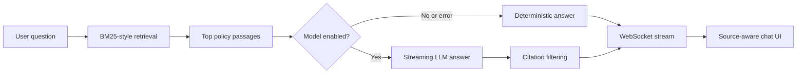

# PolicyLens

PolicyLens is a full-stack, retrieval-grounded policy assistant. It retrieves relevant passages from a source library, streams an answer over WebSockets, and turns inline citations into inspectable source links.

The application works without model credentials through a deterministic grounded-answer path. When model mode is enabled, the same retrieved context is supplied to an LLM and citations are filtered against the documents that were actually retrieved.

> **Scope:** PolicyLens is a portfolio prototype built around a small sample corpus. Retrieval is lexical (BM25-style), not embedding-based, and the included access gate is intentionally omitted rather than presented as real authentication.

## What it demonstrates

- A React and TypeScript interface designed around streaming model output
- FastAPI REST and WebSocket services
- Retrieval-grounded generation with clickable citations
- Citation allowlisting to reduce unsupported source references
- Deterministic fallback behavior when the model is disabled or unavailable
- Ephemeral sessions that persist only after the first user message
- A retrieval evaluation harness with ranked expectations
- SQLite persistence, Docker packaging, tests, and CI

## Architecture



## Stack

| Layer | Technology |
| --- | --- |
| Interface | React 19, TypeScript, Vite |
| API | FastAPI, Pydantic |
| Streaming | WebSockets |
| Retrieval | Dependency-free BM25-style scorer |
| Model integration | OpenAI Python SDK |
| Persistence | SQLModel, SQLite |
| Quality | Pytest, Vitest, retrieval evaluations, GitHub Actions |

## Run locally

### Backend

```bash
python -m venv .venv
source .venv/bin/activate
pip install -r backend/requirements.txt
uvicorn backend.app.main:app --reload --port 8000
```

The deterministic path is enabled by default, so no API key is required.

### Frontend

```bash
cd client
npm ci
npm run dev
```

Open `http://localhost:5173`.

### Enable model-backed generation

```bash
export USE_LLM=1
export OPENAI_API_KEY=...
export LLM_MODEL=gpt-4o-mini
uvicorn backend.app.main:app --reload --port 8000
```

If the model call fails, the service automatically streams the deterministic grounded answer.

## Streaming protocol

The client sends:

```json
{ "type": "user_message", "content": "What does a certificate of insurance prove?" }
```

The server emits `history`, `ack`, `token`, `final`, `complete`, and `error` events. Tokens are rendered immediately; the `final` event is authoritative and is what the server persists.

## Tests and retrieval evaluations

```bash
python -m pytest -q backend/tests
python -m backend.evals.run_evals

cd client
npm test
npm run build
```

The evaluation set asserts that the expected policy appears at rank one for representative questions. It is deliberately small but gives retrieval changes a measurable regression signal.

## API surface

| Method | Endpoint | Purpose |
| --- | --- | --- |
| `POST` | `/api/chat/session` | Create or resume a session |
| `GET` | `/api/chat/sessions` | List persisted sessions |
| `GET` | `/api/chat/session/{id}` | Fetch a persisted conversation |
| `DELETE` | `/api/chat/session/{id}` | Delete a conversation |
| `GET` | `/api/chat/policies` | Inspect the sample source corpus |
| `WS` | `/api/chat/ws/{id}` | Stream a conversation |
| `GET` | `/api/health` | Service health probe |

Interactive REST documentation is available at `http://localhost:8000/docs`.

## Configuration

| Variable | Purpose | Default |
| --- | --- | --- |
| `USE_LLM` | Enable model-backed answer generation | `0` |
| `OPENAI_API_KEY` | Model provider credential | unset |
| `LLM_MODEL` | Model used to assemble answers | `gpt-4o-mini` |
| `CHAT_DB_PATH` | SQLite database location | `backend/data/chat.db` |
| `FRONTEND_ORIGINS` | Comma-separated CORS origins | `http://localhost:5173` |
| `VITE_API_BASE` | Browser REST base URL | `http://localhost:8000/api` |
| `VITE_WS_BASE` | Browser WebSocket base URL | derived from API base |

## Deliberate limitations

- Retrieval uses a small local corpus and lexical scoring rather than embeddings.
- SQLite is suitable for the demo, not horizontally scaled chat persistence.
- A production deployment still needs authentication, authorization, rate limits, telemetry, prompt budgets, and encrypted durable storage.
- Citation filtering verifies source IDs, not whether every generated claim is semantically supported.

## Next steps

- Add hybrid lexical and embedding retrieval
- Evaluate recall, answer faithfulness, abstention, latency, and token cost
- Add tool calling for structured policy lookups
- Introduce per-user authorization and production observability

## License

MIT
